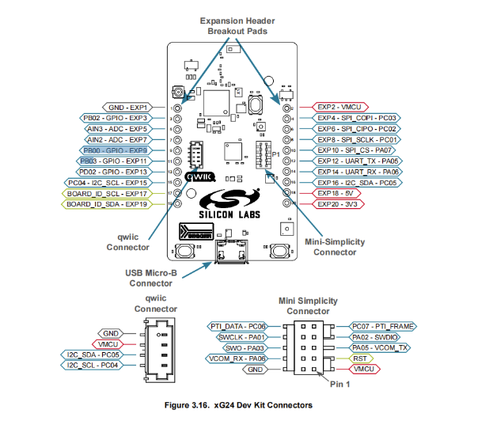
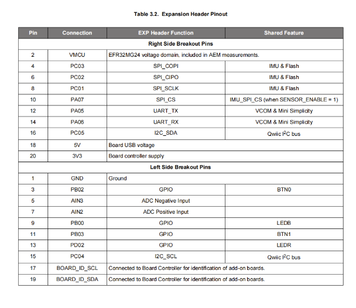

# EFR32MG24
# Get Started:
1. You need download sofware components from slcp:
- Relative Humidity and Temperature sensor
- IADC
2. Connect Pins 
- buzzer : PD02 - 13
- Button : PB03 - 11
- MQ5 : AIN2 - 10
- GND : 1
- 3V3 : 20
- 5V : 18  

 ```
   // sensor pin
  alarm_speaker_pin speaker_pin = {.port= gpioPortD, .number = 2};
  button_pin btt_pin ={.port= gpioPortB,.number=3};
  smoke_adc_pin smoke_pin = {.port = gpioPortA, .number =2};
```
# Schema
  
  
  
  